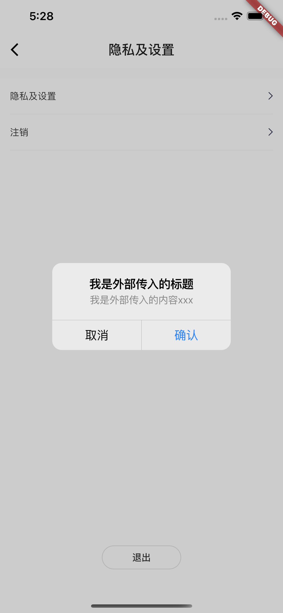
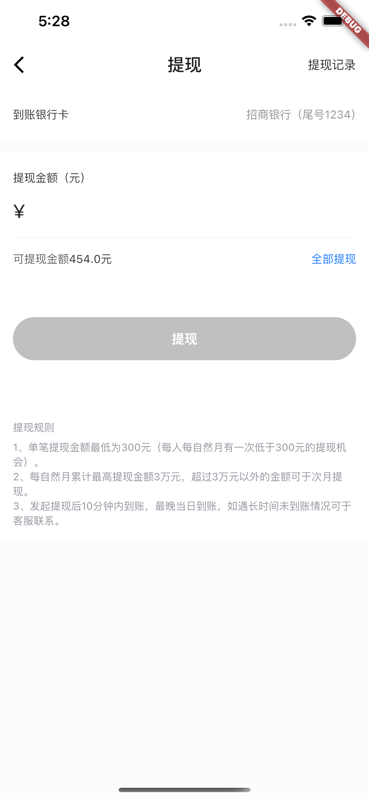

# flutter_tk
本项目为个人学习Flutter的练习项目。

## 预览

部分页面效果如下：

|      |     |    |     |
| :--------------------------------: | :---------------------------------: | :-------------------------------: | :-------------------------------:  |
|     |    |    |     |
|     |     |   |    |
|    |      |   

**觉得还可以的话，来个Star、Fork支持一波！**

## 实现内容（使用空安全版本开发）

* mvp模式
* 使用`provider` (5.x 版本)做状态管理
* 基于`dio` （4.x 版本）的网络请求封装
* 使用`Swiper` 组件实现轮播图
* 通用Widget的处理封装
* 下拉刷新 + 上拉加载更多
* 多弹框的顺序弹出
* 各种自定义Dialog
* 绘制动画效果
* 模块化路由管理

## 项目运行环境
    1. Flutter version 2.2.0
     
    2. Dart version 2.13.0
    
## 心得总结（推荐阅读）

- [Flutter跨页面改变BottomNavigationBar选中下标](https://www.jianshu.com/p/e01fd340906f)

- [Flutter中Flexible与Expanded区别](https://www.jianshu.com/p/4d589fc19a45)

- [Flutter中Text占用一整行可点击](https://www.jianshu.com/p/0d57fc4a3a6f)

## 使用到的三方库

| 库                         | 功能             |
| -------------------------- | --------------- |
| [dio](https://github.com/flutterchina/dio)                            | **网络库**       |
| [provider](https://github.com/rrousselGit/provider)                   | **状态管理**     |
| [cached_network_image](https://github.com/renefloor/flutter_cached_network_image)       | **图片加载**       |
| [fluro](https://github.com/theyakka/fluro)                            | **路由管理**     |
| [flutter_oktoast](https://github.com/OpenFlutter/flutter_oktoast)     | **Toast**        |
| [common_utils](https://github.com/Sky24n/common_utils)                | **Dart 常用工具类库**    
| [flustars](https://github.com/Sky24n/flustars)                        | **Flutter 常用工具类库**       |
| [flutter_swiper](https://github.com/best-flutter/flutter_swiper)      | **Flutter 轮播组件**       |  
| [rxdart](https://github.com/ReactiveX/rxdart)                         | **Dart的响应式扩展** |
| [webview_flutter](https://github.com/flutter/plugins/tree/master/packages/webview_flutter)    | **WebView插件**       |
| [keyboard_actions](https://github.com/diegoveloper/flutter_keyboard_actions)                  | **处理键盘事件**        
| [event_bus](http://github.com/marcojakob/dart-event-bus)           | **事件广播** |
| [encrypt](https://github.com/leocavalcante/encrypt)           | **加解密** |

详细内容可以参看[pubspec.yaml](https://github.com/applebest/flutter_tk/blob/main/flutter_tuike/pubspec.yaml)文件    

## Thanks For

- [flutter_deer](https://github.com/simplezhli/flutter_deer)
